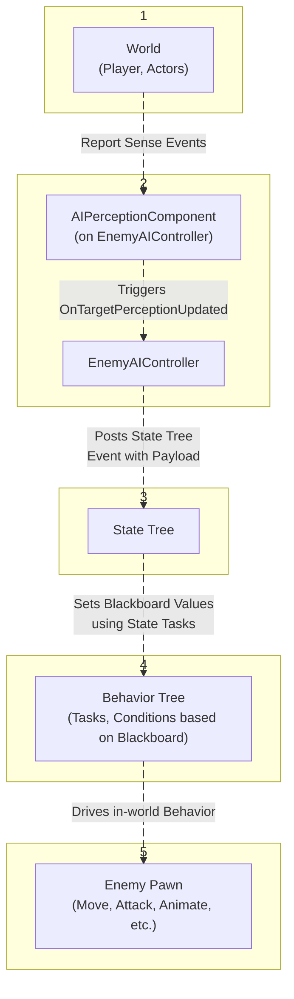

<h2>
AI System Overview
</h2>

`Behavior Trees` are a powerful tool for implementing AI decision-making logic. However, I found that tracking the AI’s current state at specific moments-and dynamically changing its behavior was inconvenient when using Behavior Trees alone.

To address this, I chose to separate certain aspects of state handling and decision-making from the `Behavior Tree` and `AI Controller`. Using `State Tree` alongside the `Behavior Tree` I was able to achieve a cleaner structure and more maintainable logic, allowing each system to play its strengths.

<br>
<br>

<h2>
Component Roles
</h2>

- `AI Controller`<br>
  Acts as the central coordinator. It owns both the Behavior Tree and the State Tree. It handles environmental perception (such as sight, sound, custom safe-zone stimuli) and passes relevant information to the State Tree.<br>

- `State Tree`<br>
  Responds to input from the AI Controller. It transitions between high-level states (Patrol, Search, Combat, Lurk) and runs associated tasks. These tasks update the Blackboard values used by the Behavior Tree.<br>

- `Behavior Tree`<br>
  Uses the current Blackboard values to drive low-level behavior logic, such as movement, animations and executing actions.<br>

This separation allows each system to focus on a specific layer of decision-making: State Tree for high-level state management, and Behavior Tree for executing detailed behavior logic.

<br>
<br>

<h2>
AI Controller & Perception System
</h2>

The `EnemyAIController` manages how the AI perceives its surroundings using Unreal’s `AIPerceptionComponent`. The perception system includes both built-in senses (sight, hearing) and a <b>custom sense</b> I implemented – <b>UAISense_Safezone</b>. This custom sense allows the AI to detect whether the player has entered special areas such as designated “Safezones”, which are invisible to standard perception but play a key role in gameplay tension.

<h3>
Handling Perception Updates
</h3>
Perception updates are handled in the controller’s `OnTargetPerceptionUpdated` callback. Instead of directly modifying the behavior or state, these events are converted into `State Tree events`, identified by `Gameplay Tags`. Each event also carries <b>relative payload data</b>, providing additional context (such as stimulus strength, actor location, relative player information). These are dispatched to the State Tree, which interprets the data and determines whether to transition to a new state – such as from <b>Patrol</b> to <b>Search</b>, or from <b>Search</b> to <b>Hostile</b>.

<div class="caption">
    AEnemyAIController.cpp
</div>

This design ensures a clean separation of concerns: the AI Controller handles sensory input and contextual data; the State Tree decides how the AI interprets and reacts to that input; and the Behavior Tree drives the specific actions. This modularity made the system easier to debug and extend. For example, adding new senses or stimuli types didn’t require touching existing behavior or state logic.














```c++
// Handle percieved senses
void AEnemyAIController::PerceptionUpdateHandler(AActor* Actor, FAIStimulus Stimulus)
{
    // ID's for senses
    const FAISenseID AISenseID_Sight = UAISense::GetSenseID<UAISense_Sight>();
    const FAISenseID AISenseID_Hearing = UAISense::GetSenseID<UAISense_Hearing>();
    const FAISenseID AISenseID_Safezone = UAISense::GetSenseID<UAISense_Safezone>();

    if (Stimulus.Type == AISenseID_Hearing)
    {
    	HandleSensingSound(Stimulus);
    }

    // Other senses
}

```

```c++
void AEnemyAIController::HandleSensingSound(FAIStimulus Stimulus) const
{
    // Gather Payload data from Stimuilus
	const FVector StimulusLocation = Stimulus.StimulusLocation;
	int64 AlertTypeValue = StaticEnum<EAlertType>()->GetValueByName(Stimulus.Tag);
	const EAlertType AlertType = AlertTypeValue == INDEX_NONE ? Cautious : static_cast<EAlertType>(AlertTypeValue);

    // Send State Tree event with Payload data
	const FStateTreePayload_NoiseEvent Payload(ProjectedLocation.Location, AlertType);
	StateTreeComponent->SendStateTreeEvent(NoiseEventTag, FConstStructView::Make(Payload));
}
```




<swiper-container keyboard="true" navigation="true" pagination="true" pacination-clickable="true" pagination-dynamic-bullets="true" rewind="true">
<swiper-slide></swiper-slide>
<swiper-slide></swiper-slide>
</swiper-container>



<swiper-container keyboard="true" navigation="true" pagination="true" pacination-clickable="true" pagination-dynamic-bullets="true" rewind="true">
<swiper-slide></swiper-slide>
<swiper-slide></swiper-slide>
</swiper-container>




<h3>
Custom Perception: Safezone Sense
</h3>

To support gameplay mechanics like protected Safezone where the player can’t be chased, I implemented a custom perception sense called `SafezoneSense`. Unreal’s build-in senses were insufficient for this case [EXPLAIN WHY]

The custom sense follows Unreal’s standard pattern using:

- `UAISenseConfig_Safezone`: configurable settings for perception range and filtering
- `FAISafezoneEvent`: encapsulates data about the event trigger
- `FDigestedSafezoneProperties`: stores the processed listener-specific data like range

```c++
USTRUCT(BlueprintType)
struct FAISafezoneEvent
{
	GENERATED_BODY()

    FAISafezoneEvent() : ID(FGuid::NewGuid()), Location(FVector::Zero()), Instigator(nullptr), SafezoneInterfaceObject(nullptr)
    {
    }

    FAISafezoneEvent(AActor* InInstigator, const FVector& InLocation, UObject* InSafezoneInterfaceObject);

    typedef class UAISense_Safezone FSenseClass;

    UPROPERTY(BlueprintReadOnly, Category="Sense")
    FGuid ID;

    UPROPERTY(EditAnywhere, BlueprintReadWrite, Category="Sense")
    FVector Location;

    UPROPERTY(EditAnywhere, BlueprintReadWrite, Category="Sense")
    TObjectPtr<AActor> Instigator;

    UPROPERTY(EditAnywhere, BlueprintReadWrite, Category="Sense")
    TObjectPtr<UObject> SafezoneInterfaceObject;

};

```

A unique aspect of the implementation is how I handle additional event data beyond what <b>FAIStimulus</b> can carry. I assign a <b>GUID</b> as the tag in the stimulus, and use it as a key to retrieve the actual payload from a <b>static map</b>. When the AI Controller receives the stimulus through `OnTargetPerceptionUpdated`, it uses the <b>GUID</b> to:

1. Retrieve the full event data
2. Pass the information to the State Tree as a tagged event
3. Immediately remove the event from the map to avoid memory buildup

<div class="caption">
    Safezone Event Management
</div>

```c++
// Inside FAISense_Safezone.h
public:
    static bool GetSafezoneEvent(FName IdAsName, FAISafezoneEvent& SafezoneEvent)
    {
        FGuid ID;
        FGuid::Parse(IdAsName.ToString(), ID);

        if (!StoredEvents.Contains(ID)) return false;
        StoredEvents.RemoveAndCopyValue(ID, SafezoneEvent);
        return true;
    }

private:
    static TMap<FGuid, FAISafezoneEvent> StoredEvents;

// ------------------------------------- //

// Inside Update() of UAISense_Safezone.cpp
for (const FAISafezoneEvent& Event : Events)
{
    // Filtering out events using digested property is here

    // Store Event and report stimulus
    StoredEvents.Add(Event.ID, Event);
    FAIStimulus Stimulus(*this, 1.f, Event.Location, Listener.CachedLocation, FAIStimulus::SensingSucceeded,
                            FName(*Event.ID.ToString(EGuidFormats::DigitsWithHyphens)));
    Listener.RegisterStimulus(Event.Instigator, Stimulus);
}
```

<div class="caption">
    Use case inside EnemyAIController
</div>

```c++
// Inside EnemyAIController.cpp
void AEnemyAIController::HandleSensingSafezone(AActor* SourceActor, const FAIStimulus& Stimulus)
{
	FAISafezoneEvent SafezoneEvent;
	bool EventFound = UAISense_Safezone::GetSafezoneEvent(Stimulus.Tag, SafezoneEvent);
	if (!EventFound) return;

	FStateTreePayload_Safezone Payload(Stimulus.StimulusLocation, SafezoneEvent.SafezoneInterfaceObject);
	StateTreeComponent->SendStateTreeEvent(SafezoneEventTag, FConstStructView::Make(Payload));
}
```

This approach allowed me to preserve Unreal’s perception API structure while extending it with robust, memory-safe event data flow.

<br>
<br>

<h2>
State Tree - Structure, States and Transitions
</h2>

The State Tree is the core of my AI’s high-level decision-making. It manages which state the enemy is currently in, Transitions between states based on events, and runs tasks that modify the behavior indirectly via the Blackboard.

<h3>
State Structure & Execution Flow
</h3>

The State Tree is structured as a hierarchy of `Behavioral` and `Transitional` states (Colored and Gray), each with a clear purpose:

- `Behavioral` (colored) states represent the actual high-level states the AI can be in. These are always leaf states-the final nodes in a state branch-and are the only states that execute tasks which write into blackboard. Each Behavioral State defines what the AI is doing at that moment, such as <i>Patrolling</i>, <i>Searching Cautiously</i>, engaging in <i>Combat</i>, or <i>Lurking</i> in a safe-zone area.

- `Transitional` (gray) States serve as a routing logic between events and <b>Behavioral</b> States. They are similar to the states which have a type set to “Linked”, however they can execute tasks. Their role is to:
  1. Receive State Tree events triggered by the AI Controller (e.g. OnNoise, OnSightGained)
  2. Fill shared <b>parameter data structures</b> with context (event payload)
  3. Instantly transition into the appropriate Behavioural State

This separation of responsibilities allows the AI to respond to complex inputs in a <b>modular</b> and maintainable way. Transitions are decoupled from behavior logic, and payload data is passed cleanly through parameters-enabling each Behavioral State to react appropriately without needing to know the source of the trigger.
